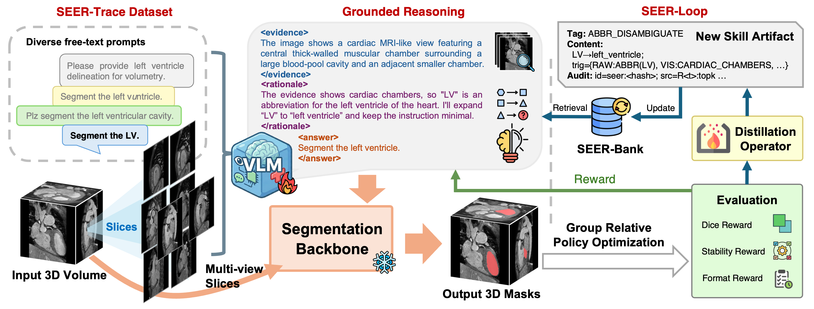

# SEER: Skill-Evolving Grounded Reasoning for Free-Text Promptable 3D Medical Image Segmentation

<div align="center">

[](https://arxiv.org/abs/2603.08215)&#160;
[](https://github.com/Ztrura/SEER)&#160;
[](https://huggingface.co/Ztrura/SEER)&#160;
[](https://seer-medseg.github.io/)&#160;
[](https://opensource.org/licenses/MIT)&#160;

</div>

## 📖 Overview

This repository provides the official implementation of our paper:

> **SEER: Skill-Evolving Grounded Reasoning for Free-Text Promptable 3D Medical Image Segmentation**

SEER is a vision-language reasoning model designed for robust free-text promptable 3D medical image segmentation. It grounds clinical language in image evidence, evolves reusable reasoning skills, and produces an executable target specification for a downstream segmentation backbone. Compared with state-of-the-art baselines, SEER reduces performance variance by 81.94% and improves the worst-case Dice score by 18.60% under linguistic perturbations.



---

## 📰 News & TODO

We are currently organizing the codebase to ensure a clean and reproducible open-source release. Further updates will be added here.

- [ ] **[Coming Soon]** Release the training scripts.
- [x] **[2026-06]** Release SEER checkpoint v1.1, checkpoint v1.0, and the corresponding SEER-Trace evaluation split.
- [x] **[2026-06]** Release dataset preparation guidelines and inference code.
- [x] **[2026-05]** Paper is early accepted by MICCAI 2026.

---

## 🚀 Getting Started

### 1. Environment Setup

We recommend using Conda with Python 3.10.

```bash
conda create -n seer python=3.10
conda activate seer
```

Install PyTorch 2.8.0 with CUDA 12.6:

```bash
pip install torch==2.8.0 torchvision==0.23.0 torchaudio==2.8.0 --index-url https://download.pytorch.org/whl/cu126
```

Install FlashAttention using the prebuilt wheel that matches the environment above.

Direct installation with `pip install flash-attn==2.8.3` may trigger a local build from source, which can fail due to CUDA, compiler, or build-toolchain mismatches. Therefore, we recommend downloading the matching wheel from the [official FlashAttention v2.8.3 release page](https://github.com/Dao-AILab/flash-attention/releases/tag/v2.8.3#:~:text=flash_attn-2.8.3%2Bcu12torch2.8cxx11abiFALSE-cp310-cp310-linux_x86_64.whl) and installing it locally:

```bash
pip install flash_attn-2.8.3+cu12torch2.8cxx11abiFALSE-cp310-cp310-linux_x86_64.whl
```

Then clone this repository and install the remaining dependencies:

```bash
git clone https://github.com/Ztrura/SEER.git
cd SEER
pip install -r requirements.txt
```

Verify the environment:

```bash
cd test_scripts
python environment_test.py
```

### 2. Dataset Preparation

Evaluation uses [BrainMetShare](https://aimi.stanford.edu/datasets/brainmetshare) and [PENGWIN](https://pengwin.grand-challenge.org/data/).

To preprocess the datasets, run:

```bash
cd scripts
python prepare_BMS.py --generate-png --force-existing
python prepare_PENGWIN.py --generate-png --force-existing
```

### 3. Inference

Download the SEER checkpoints from [Hugging Face](https://huggingface.co/Ztrura/SEER) and place them in the expected checkpoint directory.

##### Single-case inference

```bash
cd test_scripts
python infer_test.py
```

##### Batch inference

```bash
cd infer/v1_1
chmod +x run_infer_v1_1.sh
./run_infer_v1_1.sh
```

Note that the released checkpoints provide the VLM reasoning weights only. To obtain final 3D segmentation masks, please integrate a compatible 3D segmentation backbone separately, such as [VoxTell](https://github.com/MIC-DKFZ/VoxTell) or [MedSAM3](https://github.com/Joey-S-Liu/MedSAM3).

## 🩺 Ethical Considerations

Medical image models may produce plausible but incorrect explanations. Users should treat outputs as research results rather than clinical conclusions. Do not use this model to replace professional medical judgment.

## 🔗 Citation

If you find our work helpful for your research, please cite:

```bibtex
@article{zhang2026seer,
      title     = {Skill-Evolving Grounded Reasoning for Free-Text Promptable 3D Medical Image Segmentation},
      author    = {Zhang, Tongrui and Wang, Chenhui and Li, Yongming and Chen, Zhihao and Zhan, Xufeng and Shan, Hongming},
      journal   = {arXiv preprint arXiv:2603.08215},
      year      = {2026}
}
```